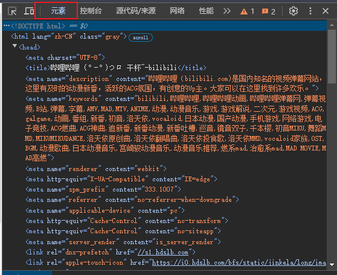
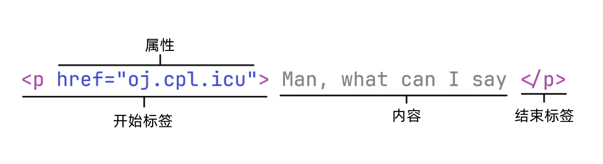

# 命令行浏览器

> 本题还处于初级阶段，内容极有可能发生改变
>
> 如果你对此题有好的建议或者疑问，mail to 221850148@smail.nju.edu.cn

todo list:

- 部分例子无法渲染出下划线，需要修改成图片
- 写标程
- 完善实现提示
- 造样例与测试数据

---

## 题目描述

小 A 在 CPL 课上接触到了命令行，发现命令行对工作效率的提升有如神助，于是便下定决心成为命令行高手。小 A 打开命令行，想要百度一下如何成为[命令行高手](https://zhuanlan.zhihu.com/p/71776854)。尴尬的是，小 A 发现他甚至无法通过命令行来访问网页。于是小 A 找到了你，希望你为他写一个命令行可用的浏览器。

为了简化题目，尽可能减少大家的工作量，贴心的小 A 已经把浏览器网络相关的部分写好了，我们只需要实现对**网页的解析与渲染**。即：输入并解析网页源代码，并输出网页的渲染结果。

我们要做的所有工作蕴含在这**三个问题**的答案里：解析什么？怎么解析？怎么渲染？

### 解析什么

解析 HTML —— HyperText Markup Language (超文本标记语言)。

> 作为[前端三件套](https://www.w3cschool.cn/article/35382959.html)之一，HTML 是今后接触软件开发绕不开的东西(甚至你现在正在看的这篇文档，从某种程度上来说也是 HTML)。学有余力的同学可以看[HTML（超文本标记语言） | MDN](https://developer.mozilla.org/zh-CN/docs/Web/HTML)，以及同站的 CSS 和 JS 的介绍。

网页并不是像 PPT 那样，把需要的元素拖到对应位置上就万事大吉的，而是通过一种叫 HTML 的语言来组织，以实现丰富的功能。

你可以随便打开一个网页，按下 `F12` 并切换到 `元素` 一栏，来查看当前网页的 HTML 源代码。



你能访问到的网站的 HTML 都相当复杂。我们从基础开始。

### 如何解析

> 保证所有样例遵循下面的解析规则

#### 单个元素的解析

从最朴素的角度思考，我们要用一串代码来表示网页中的一个元素内容，比如一个字符串，应该怎么实现？

当然是直接用这个字符串表示他自己：

```text
Man, what can I say
```

但是我们还得考虑到，网页中的一串字符，应该还要拥有一系列**属性**，包括字号、字体、加粗、斜体等等。直接把属性写到代码里的话，我们如何区分属性和内容呢？

在 HTML 里是这样规定的：



- 将要渲染的**内容(content)**用**标签(tag)**包裹起来，内容前的是**开始标签(opening tag)**，后面的是**结束标签(closing tag)**
- 标签是用 `<` 和 `>` 包裹的字符串
    - 标签包含**元素名**。元素名指示了当前这一整个元素是哪一类内容(例子中元素名为 `p`)
    - 开始标签中，还包含了**属性(attribute)**
    - 结束标签中，在元素名前面有一个正斜杠 `/`
- 属性由**属性名**、等于号和**属性值**构成。特殊地，某些属性可以只由属性名构成，详见后面的例子
    - 开始标签中可以有多个属性，每个属性间由一个或多个空格分开
    - 属性值用双引号包裹
- 这一整个东西表示一个**元素(element)**

所以，上图中的例子，表示有一个元素 `p`，内容是 `Man, what can I say`，拥有属性 `href`，值是 `oj.cpl.icu`。

再来几个例子：

```html
<h1 em justify="center">Manba out</h1>
```

表示一个 `h1` 元素，内容是 `Manba out`，拥有属性 `em` 和 `justify`，后者值为 `center`。

```html
</img>
```

表示一个 `img` 元素，没有内容(为什么会存在没有内容的元素？这里先按下不表，详见渲染部分)，拥有属性 `src`，值为一个网页链接。

#### 嵌套元素的解析

看完上一节内容，相信你可以十分甚至九分轻松地解析出单个 html 元素了。但是在 html 中，还有一个重要的特性需要我们去了解：嵌套元素。

简而言之，嵌套元素允许我们将一个或多个元素作为另外一个元素的内容。如下：

```html
<div>
    <h1>Man, </h1>
    <p>What can I say<p>
    <p>Manba out</p>
</div>
```

这样做能够显式地表达元素间的*父子关系*。子元素可以**继承**父元素的位置以及某些属性。

> 子元素能从父元素继承大部分属性，但有些属性**无法继承**。后面会介绍。
>
> 子元素从父元素继承到的属性可能对渲染没有任何作用。后面会介绍对于每一种元素，接受哪些属性是有效的。

有了嵌套，我们可以设计出一些专门用于嵌套的元素，这些元素并不直接渲染内容，而是为嵌在其内部的元素提供属性。在我们的实现中，**只有** `div` 这一种元素能支持嵌套。

```html
<div em>
    <p>All</p>
    <p>Good</p>
</div>
```

上例就是用一个含有加粗属性的 div 元素包裹两个 p 元素，以实现这两个 p 元素中内容的加粗。

值得注意的是，在**任何地方**的**换行**对渲染是没有任何作用的，换行仅仅是为了 HTML 代码的美观。

### 如何渲染

在解析了 HTML 之后，你需要将其中的元素按规则渲染到一个宽为 80，高为 40 的字符命令行界面上。为了简化，你只需要渲染到一个 char\[40]\[80] 的二维字符数组中，并打印出来即可。

每一种元素有其独特的渲染方式，并且会根据属性来进行一些调整。

> 本项目意在帮助大家建立对 HTML 的认识，所以并不会让大家真的去解析正版 HTML。下面的内容都是助教的简化魔改版。

我们分别介绍*元素*、*布局*以及*属性*。此三者之间互有关联，有理解不了的很正常，暂时跳过即可。建议反复阅读。

#### 元素

介绍元素时，其中的*属性*表示仅有列出的属性对这个元素有**渲染上的作用**。其他的属性——如无特殊说明——对元素没有作用。

列出的属性，如果是*无值*的，或者*必选*的，会标出。否则为*有值*且*可选*属性。

在嵌套结构中无法被继承的属性会标出*不可继承*。

##### 标题(Heading)

- 元素名：`h`
- 属性：
    - `color`：文本颜色。接受颜色字符串。为`none`, `white`, `red`, `blue`, `green`中的一个。文本在命令行中的默认颜色为 `none`。
    - `em`：emphasis，文本加粗。<u>无值</u>。
    - `i`：italic，文本斜体。<u>无值</u>。
    - `u`: underline, 文本下划线。<u>无值</u>。

以全**大写字符**的形式，渲染内容中的文本。

示例：

```html
<h em color="white">God, this project seems so hard!</h>
```

**GOD, THIS PROJECT SEEMS SO HARD!**

##### 段落(Paragraph)

- 元素名：`p`
- 属性：
    - `color`, `em`, `i`, `u`

渲染内容中的文本。

示例：

```html
<p i u>Maybe it's not that hard.</p>
```

<u>*Maybe it's not that hard.*</u>

##### 图片(IMaGe)

- 元素名：`img`
- 属性：
    - `src`：图片内容。接受一个可见字符组成的字符串，表示图片在命令行中要显示什么字符。<u>必选</u>。
    - `width`：图片宽度。接受一个整数，表示图片一行有多少个字符。保证能整除 src 中字符串的长度。<u>必选</u>。

渲染 src 中的图片。

示例：

```html
</img>
```

```
↖↑↗
←o→
↙↓↘
```

##### 容器(DIVision)

- 元素名：`div`
- 属性：
    - `w`：容器宽度。接受一个正整数，表示容器的宽度，单位为字符。<u>不可继承</u>。
    - `h`：容器高度。接受一个正整数，表示容器的高度，单位为字符。<u>不可继承</u>。
    - `direction`：容器内元素排列方向。接受一个字符串，为 `row` 和 `column` 中的一个，表示容器中元素按*行*布局还是按*列*布局(在后面的布局中会详细说明，不理解可以暂时放放)。如果没有指定，则默认为按行布局。<u>不可继承</u>。
    - `align-items`：容器内元素垂直排布方式。接受一个字符串，为 `start`, `center`, `end`, `space-evenly` 中的一个。详见布局。<u>不可继承</u>。
    - `justify-content`：容器内元素水平排布方式。接受一个字符串，为 `start`, `center`, `end`, `space-evenly` 中的一个。详见布局。<u>不可继承</u>。
    - 之前提及的所有属性。对容器的布局不产生作用，但是会向下继承。
- 注意：
    - 只有容器能拥有子元素


示例(注意渲染结果中的空格)：

```html
<div 
     w="10" 
     h="5" 
     direction="column" 
     align-items="center" 
     justify-content="end"
     i u
     >
        <p>Upper</p>
        <p>Middle</p>
        <p>Lower</p>
</div>
```

​     *<u>Upper</u>*


​    *<u>Middle</u>*


​     *<u>Lower</u>*

#### 属性

属性的继承遵循以下规则：

1. *子元素*继承**所有**来自*父元素*的<u>可继承</u>的属性

2. 从*父元素*继承的属性与*子元素*自己所拥有的属性发生*冲突*时，以*子元素*的属性为准

    - ```html
        <div color="white">
            <p color="red">I'm Red</p>
        </div>
        ```

    - 上例中，`color` 属性以 p 元素的为准

我们给出一个尽可能全的例子，方便大家理解与实现：

```html
<div color="white">
    <div color="red">
        <p>A</p>
        <p color="green">B</p>
    </div>
    <div em>
        <p color="red">C</p>
        <p>D</p>
    </div>
    <p i>E</p>
</div>
```

这之中，各个元素所拥有的属性如下图：


其中，**绿色**的属性是这个元素**自己声明**的属性。**紫色**属性是从某个父元素**继承得来**的属性。

> 这里的表示用到了[树的数据结构](https://oi-wiki.org/graph/tree-basic/)，但大家不用担心，具体实现可以不用任何树的知识，课上和平时作业的知识足够了

#### 布局

##### 位置

只有两点需要强调：

1. HTML 代码中的元素，从网页的左上角开始依次渲染
2. div 中的子元素，从 div 的左上角开始依次渲染

例子：

```html
<div w="10" h="3">						// div 1
    <div w="5" h="2"></div>				// div 2
</div>
<div w="10" h="3">						// div 3
	<div w="5" h="2"></div>				// div 4
</div>					
```


##### 元素尺寸

元素的尺寸由*宽*和*高*构成，单位均为字符。

- `p` 和 `h` 元素的宽度为其内容的字符数，高度为 1
- `img` 元素的宽度由 `width` 指定，高度为 `src` 中字符串长度除以 `width`
- `div` 元素的尺寸由 `w` 和 `h` 指定，前者为宽度，后者为高度
    - 如果其中一个未指定，则由 div 的子元素决定。详情看下面的行列布局第二点

##### 行列布局

**按行布局**：并列的元素，每个元素单占一行。见下图中左侧。

**按列布局**：并列的元素，每个元素单占一列。见下图中右侧。


行列布局有以下要注意的点

1. 当没有指定行列布局时，默认**按行布局**
    - 无论是对某个 div 还是对整个页面，只要没有要求按列布局，那就是按行布局
2. 对于一个 div 而言，如果没有指定其 `w` 或 `h` 属性：
    - 如果是按行布局，div 的宽度是和子元素中最宽的那个相同；高度是所以子元素高度之和
    - 如果是按列布局，div 的宽度是所有子元素宽度之和；高度和子元素最高的相同
    - 如果没有子元素，那 `w` 或 `h` 就是 0。这个 `div` 不需要被渲染
3. 对于一个 div 而言，指定了 `w` 或 `h` 属性，子元素超出这个高度或宽度的部分**不需渲染**

##### 对齐

水平和垂直的对齐是分别通过 `justify-content` 和 `align-items` 实现的。

二者基本相似，所以下面以**水平对齐**为例，垂直对齐请自行推导。

对齐的本质是如何分配*当前容器的宽度*减去*子元素宽度和*，所剩的这部分宽度。或者称之为*空白宽度*。我们记为$w$。

- `start`：空白宽度全部放容器最右边。
- `end`：空白宽度全部放容器最左边。


- `center`：空白宽度分成两等份，一份左边一份右边。子元素在中间。
    - 由于 $w$ 可能无法被 2 整除，所以令左空白为 $w/2$，右空白为 $w-w/2$


- `space-evenly`：空白宽度分成 $n+1$ 等份，其中 $n$ 是行方向上元素的数量
    - 同样地，$w$ 可能无法被 $n+1$ 整除，所以令**最后一个空白**为 $w-w/(n+1)*n$，其他空白为$w/(n+1)$


## 实现提示

> 目前出题助教还没写出标程，以下提示是拍拍脑袋想出来的，仅供参考！

### 输入

- 输入的 HTML 源代码中，换行是没有任何作用的。可以随意丢掉。
- 建议使用 `getchar()` 读入

### 扫描 HTML 源代码

HTML 源码是嵌套风格的语言。说到嵌套风格，你有没有想起来[括号序列](https://oj.cpl.icu/contest/15/problem/88)？我们使用类似的策略来扫描 HTML 源码序列。

简而言之，遇到了*开始标签*，说明我们当前在扫描这个元素。遇到*结束标签*，这个元素扫描结束。

在开始与结束之间：

- 你知道你正在和哪个元素打交道：最近一次扫描到的开始标签
- 你知道当前元素的所有父元素：遇到了开始标签但未遇到结束标签的元素，都是当前元素的父元素（除了它自己）。


### 预处理

扫描一遍 HTML 源码就完成解析与渲染，对于递归功底要求很高（但也没那么高，感兴趣可以尝试），尤其是对布局的处理。所以可以先进行一遍预处理，得到一些重要的信息：

- 每个元素的尺寸：用于对齐
- div 元素的直接子元素个数：还是用于对齐

这些信息怎么和元素对应上呢？很简单，一维数组即可。扫描 HTML 时，每个元素的访问是有先后顺序的，0号1号2号...

### 解析与渲染

解析这个词太抽象了。我们只要先搞清楚每一个元素有哪些属性就行。

一个元素的属性来自两个地方：

- 元素本身的开始标签中
- 从一堆父元素那里继承

实现的思路很简单。我们开一个数组，遇到了开始标签，就把这个开始标签中的属性一个一个加到数组尾部。遇到了结束标签，就把对应开始标签中的属性一个一个从数组里踢掉。这样能保证我们在扫描到某个元素的内容时，数组里的标签就是当前元素以及其所有父元素的标签了。

至于属性覆盖问题，由于我们只从数组尾部加属性，所以一定是下标大的属性覆盖下标小的。我们渲染元素时，只需要倒着扫描这个数组，找到对渲染有作用的属性就行。

实际上，这个数组是作为栈来使用的。可以回想一下括号序列，思考其中的关联性。

## 测试数据

### 数据约定

对于所有测试点，保证：

- 严格控制标签格式

    - ```html
        <p i u color="wow">Nihao</p>
        ```

    - 开始标签中，*元素名*与*属性*间、*属性*与*属性*间存在一个空格。还可能存在一些换行，建议输入的时候就忽略掉。

    - 结束标签不含空格

### 数据分布

暂定为如下分布：

- 20% 的数据只包含 `p` 和 `h` 元素
- 50% 的数据只包含 `p`, `h` 和 `img` 元素
- 80% 的数据包含全部元素。保证 `div` 元素只含 `w` 和 `h` 属性
- 100% 的数据包含全部元素与属性

## 输入格式

 输入一个不知道多少行的魔改版 HTML 源代码。代码总长度小于 $10^5$。

## 输出格式

输出一个 40 * 80 字符的网页渲染结果。

## 测试样例

### 样例一

```html
<p>Hello</p>
```

```
Hello
```

### 样例二

更多样例等待添加...
